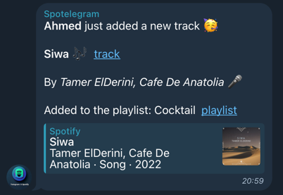

# SpotifySpy

## Description

SpotifySpy is a python self-contained script that allows watching a collaborative playlist on Spotify and sends a message to a Telegram chat when a new track is added to the playlist.


## How it works

The script uses the Spotify API to get the current playlist snapshot and compares it with the previous snapshot. If a new track is found, it sends a message to the Telegram chat with the track information.
It stores the current snapshot in a file to compare it with the next one.
Periodically, the script checks for new tracks in the playlist.

## Requirements

- Telegram Bot [Create a Telegram Bot](https://core.telegram.org/bots#3-how-do-i-create-a-bot)
  - You will get a token that you will use to authenticate the bot.
- Telegram Chat ID
  - You can get the chat ID by sending a message to the bot and then calling the following URL:
    ```
    https://api.telegram.org/bot<YourBOTToken>/getUpdates
    ```
    Replace `<YourBOTToken>` with the token of your bot. You will get a JSON response with the chat ID.
- Spotify App
  - You need to create a Spotify Developer account and create a new app to get the client ID. [Guide](https://developer.spotify.com/documentation/web-api)
  - Spotify Client ID
  - Spotify Client Secret
- Spotify Playlist ID
  - You need to get the ID of the playlist you want to watch. You can get it from the Spotify app or the web player.

## Running the script

The application will look for the following environment variables:
- `SPOTIFY_TOKEN_URL`: Spotify token URL. Default value: `https://accounts.spotify.com/api/token`
- `SPOTIFY_CLIENT_ID`: Spotify client ID.
- `SPOTIFY_CLIENT_SECRET`: Spotify client secret.
- `SPOTIFY_PLAYLIST_ID`: Spotify playlist ID.
- `BOT_TOKEN`: Telegram bot token.
- `TARGET_CHAT_ID`: Telegram chat ID.
- `STORAGE_BACKEND`: Storage backend. Options: `filesystem` or `s3`
- `FILESYSTEM_STORAGE_PATH`: Filesystem storage path. Default value: `$HOME/SpotifySpy/data/`
- `S3_REGION`: AWS region.
- `S3_BUCKET`: AWS S3 bucket.
- `S3_ACCESS_KEY_ID`: AWS access key ID.
- `S3_SECRET_ACCESS_KEY`: AWS secret access key.
- `CHECK_INTERVAL`: Check interval in seconds. Default value: `60`

Notes:
- You can also set the environment variables in a `.env` file.
- You can pass the required environment variables when running the script as CLI arguments where the key is the environment variable name in lowercase and prefexed with `--`. For example, `--spotify_client_id`.
- In case you use the `s3` storage backend, you need to set all the `S3_` environment variables.
- The script will use the `filesystem` storage backend by default and store the data in the directory which is defined by the `FILESYSTEM_STORAGE_PATH` environment variable.

### Docker

Run a Docker container with the following command:

```bash
docker pull montaro/spotifyspy
docker run --env-file=.env montaro/spotifyspy:latest
```

### Local

1. Clone the repository:
    ```bash
    git clone [REPO_URL] 
    cd SpotifySpy
    ```
2. Prepare the environment:
    - Create a `.env` file (Check the env.dist file for reference) or set the environment variables or pass them as CLI arguments.

3. Install the dependencies:
    ```bash
    pip install python-poetry
    poetry shell
    poetry install --no-dev --no-root
    poetry run python -m main
    ```

If all the environment variables are set correctly, the script will start watching the playlist and sending messages to the Telegram chat when a new track is added.
Output example:
```
➜ poetry run python -m main

2024-06-15 20:58:46,472 - spotifyspy - INFO - Loading configuration...
2024-06-15 20:58:46,473 - spotifyspy - INFO - Configuration loaded
2024-06-15 20:58:46,473 - spotifyspy - INFO - Storage backend is set to: filesystem
2024-06-15 20:58:46,473 - spotifyspy - INFO - Storage path set to: $HOME/spotify-playlist-telegram/data/
2024-06-15 20:58:46,967 - spotifyspy - INFO - Spotify playlist: Cocktail with ID: XYZ
2024-06-15 20:58:46,973 - spotifyspy - INFO - Stored playlist: Cocktail with ID: XYZ
2024-06-15 20:58:46,973 - spotifyspy - INFO - Update the stored playlist with the current playlist...
2024-06-15 20:58:46,992 - spotifyspy - INFO - No new tracks have been added to the playlist in the last cycle!
2024-06-15 20:58:46,992 - spotifyspy - INFO - Sleeping for 60 seconds...
```

When a new track is added to the playlist, the script will send a message to the Telegram chat:
```
2024-06-15 20:59:47,553 - spotifyspy - INFO - Spotify playlist: Cocktail with ID: XYZ
2024-06-15 20:59:47,558 - spotifyspy - INFO - Stored playlist: Cocktail with ID: XYZ
2024-06-15 20:59:47,558 - spotifyspy - INFO - Update the stored playlist with the current playlist...
2024-06-15 20:59:47,575 - spotifyspy - INFO - Playlist has been updated with a new track: Siwa - Sending a chat message...
2024-06-15 20:59:47,879 - httpx - INFO - HTTP Request: POST https://api.telegram.org/botXXXXX/sendMessage "HTTP/1.1 200 OK"
2024-06-15 20:59:47,884 - spotifyspy - INFO - Sleeping for 60 seconds...
```

Telegram message example:




## License

This project is licensed under the GNU General Public License v3.0
